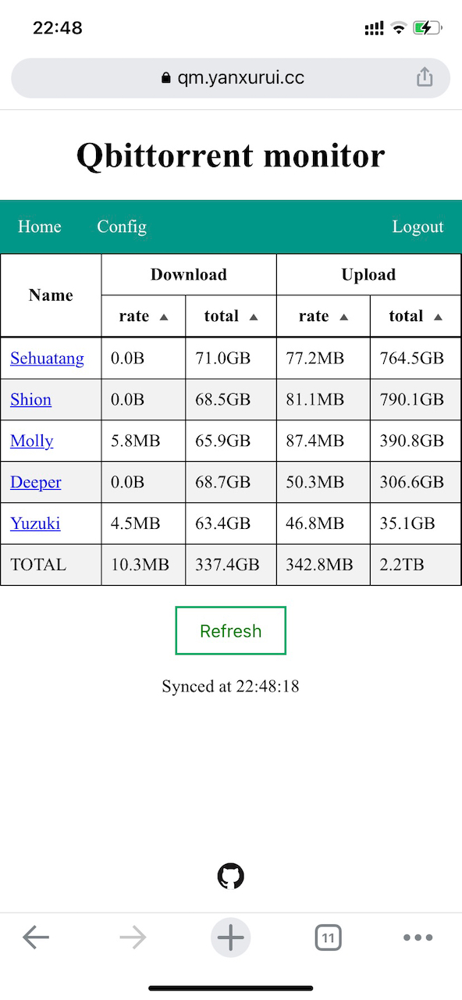
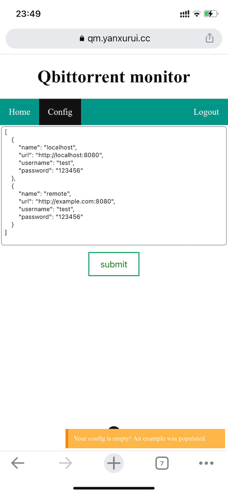

# qb-monitor

A simple web app to monitor multiple qbittorrent instances.

<p align="center">


</p>

## Implementation
* frontend: Vue3.js
    * pinia: to store user data shared across components
    * router
    * vue3-notification
    * vue-final-modal
    * vue3-google-login: login requires access to google account

* backend: aiohttp + sqlite3

## Development
```sh
cd frontend
npm install
npm run dev

cd ..

cd backend
pip install -r requirements.txt
python main.py
```

## Deployment (using NGINX)
```sh
cd frontend
npm i
npm run build
sudo cp -Tr dist /var/www/qm # soft link does not work

cd ..

cd backend
ln -s /home/yxr/qb-monitor/backend/supervisord.conf qb-monitor.ini
supervisorctl reread
supervisorctl update
supervisorctl status
```

NGINX config snippet
```conf
server {
    listen 443 ssl;
    listen [::]:443 ssl;
    server_name qm.yanxurui.cc;
    access_log /var/log/nginx/qm.access.log main;

    # frontend
    location / {
        root /var/www/qm;
        try_files $uri $uri/ /index.html;
    }

    # backend
    location /api/ {
        autoindex on;
        proxy_pass   http://127.0.0.1:5001/;
    }
}
```
